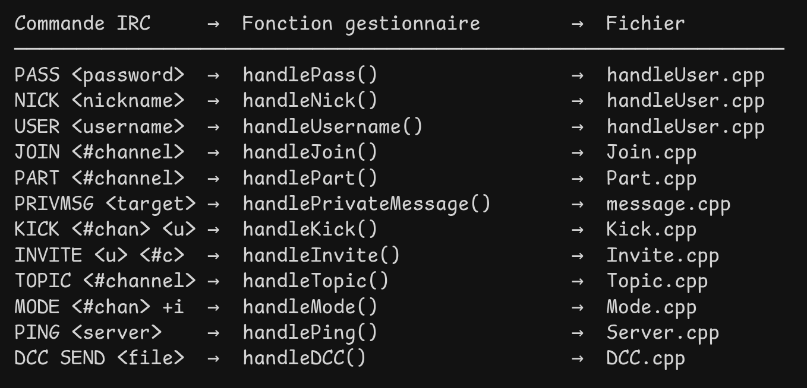

# ft_irc - Internet Relay Chat Server

## 📋 Table des matières

- [Vue d'ensemble](#vue-densemble)
- [Objectifs du projet](#objectifs-du-projet)
- [Prérequis](#prérequis)
- [Compilation](#compilation)
- [Utilisation](#utilisation)
- [Documentation](#documentation)
- [Structure du projet](#structure-du-projet)
- [Tests](#tests)

## 🎯 Vue d'ensemble

**ft_irc** est un projet de l'école 42 consistant à implémenter un serveur IRC (Internet Relay Chat) en C++98. L'objectif est de reproduire le fonctionnement d'un serveur IRC capable de gérer plusieurs clients simultanément en utilisant des I/O non-bloquantes.

### Qu'est-ce que IRC ?

Internet Relay Chat est un protocole de communication textuel sur Internet permettant :
- La communication instantanée en temps réel
- Les discussions en groupe via des canaux (channels)
- La communication privée entre deux personnes
- La gestion de canaux avec opérateurs et utilisateurs

## 🎯 Objectifs du projet

### Partie obligatoire

- ✅ Développer un serveur IRC en C++98
- ✅ Gérer plusieurs clients simultanément sans blocage
- ✅ Utiliser un seul `poll()` (ou équivalent) pour toutes les opérations I/O
- ✅ Communication TCP/IP (v4 ou v6)
- ✅ Authentification des clients
- ✅ Support des nicknames et usernames
- ✅ Gestion des canaux (channels)
- ✅ Messages privés et messages de canal
- ✅ Système d'opérateurs et utilisateurs basiques

### Commandes obligatoires

#### Commandes de base
- **Authentification** : Connexion avec mot de passe
- **NICK** : Définir un nickname
- **USER** : Définir un username
- **JOIN** : Rejoindre un canal
- **PRIVMSG** : Envoyer des messages privés

#### Commandes opérateur
- **KICK** : Éjecter un client du canal
- **INVITE** : Inviter un client au canal
- **TOPIC** : Modifier ou afficher le thème du canal
- **MODE** : Changer le mode du canal
  - `i` : Canal sur invitation uniquement
  - `t` : Restriction TOPIC pour opérateurs
  - `k` : Définir/supprimer clé du canal (mot de passe)
  - `o` : Donner/retirer privilège opérateur
  - `l` : Limiter le nombre d'utilisateurs

### Partie bonus

- 📁 Envoi de fichiers
- 🤖 Bot IRC

## 📦 Prérequis

### Compilateur et normes
- Compilateur C++ compatible C++98
- `make`
- Flags de compilation : `-Wall -Wextra -Werror -std=c++98`

### Fonctions autorisées
```
socket, close, setsockopt, getsockname, getprotobyname,
gethostbyname, getaddrinfo, freeaddrinfo, bind, connect,
listen, accept, htons, htonl, ntohs, ntohl, inet_addr,
inet_ntoa, send, recv, signal, sigaction, lseek, fstat,
fcntl, poll (ou équivalent)
```

### Contraintes
- ❌ Pas de bibliothèque externe ni Boost
- ❌ Pas de forking
- ❌ Pas de communication serveur à serveur
- ✅ Toutes les I/O doivent être non-bloquantes
- ✅ Un seul `poll()` (ou équivalent) pour gérer toutes les opérations

## 🔨 Compilation

```bash
make
```

Le Makefile contient les règles suivantes :
- `make` ou `make all` : Compile le serveur
- `make clean` : Supprime les fichiers objets
- `make fclean` : Supprime les fichiers objets et l'exécutable
- `make re` : Recompile entièrement le projet

## 🚀 Utilisation

### Lancement du serveur

```bash
./ircserv <port> <password>
```

**Arguments :**
- `port` : Numéro du port d'écoute pour les connexions entrantes
- `password` : Mot de passe requis pour se connecter au serveur

**Exemple :**
```bash
./ircserv 6667 motdepasse123
```

### Connexion avec un client IRC

Le client de référence pour tester ce serveur est **irssi**.

**Installation d'irssi :**
```bash
# Ubuntu/Debian/Kali
sudo apt install irssi

# macOS
brew install irssi
```

**Connexion avec irssi (recommandé) :**
```bash
irssi
/connect localhost 6667 motdepasse123
/nick alice
/join #general
/msg #general Bonjour tout le monde !
```

**Commandes irssi essentielles :**
- `/connect <serveur> <port> <password>` - Se connecter au serveur
- `/nick <pseudo>` - Définir votre pseudonyme
- `/join <#canal>` - Rejoindre un canal
- `/msg <#canal|pseudo> <message>` - Envoyer un message
- `/quit` - Se déconnecter
- `Alt+[1-9]` - Naviguer entre les fenêtres

## 📚 Documentation

La documentation détaillée est organisée dans le dossier `docs/` :

- **[PROTOCOL.md](docs/PROTOCOL.md)** : Explications du protocole IRC
  - Format des messages
  - Commandes IRC détaillées
  - Codes de réponse
  
- **[ARCHITECTURE.md](docs/ARCHITECTURE.md)** : Architecture du serveur
  - Structure du code
  - Classes et modules
  - Flux de données
  
- **[TECHNICAL.md](docs/TECHNICAL.md)** : Concepts techniques
  - I/O non-bloquantes
  - Multiplexage avec poll/select
  - Gestion des sockets
  - Parsing des commandes
  
- **[IMPLEMENTATION.md](docs/IMPLEMENTATION.md)** : Guide d'implémentation
  - Étapes de développement
  - Détails des commandes
  - Gestion des erreurs

  

## 📁 Structure du projet

```
ft_irc/
├── README.md                 # Ce fichier
├── Makefile                  # Compilation du projet
├── fr.subject.txt           # Sujet original
├── docs/                    # Documentation détaillée
│   ├── PROTOCOL.md          # Protocole IRC
│   ├── ARCHITECTURE.md      # Architecture du serveur
│   ├── TECHNICAL.md         # Concepts techniques
│   └── IMPLEMENTATION.md    # Guide d'implémentation
├── srcs/                    # Code source
│   ├── main.cpp
│   ├── server/              # Classes serveur
│   ├── client/              # Classes client
│   ├── channel/             # Classes canal
│   └── commands/            # Commandes IRC
└── includes/                # Fichiers headers
    └── *.hpp
```

## 🧪 Tests

### Client de référence : irssi

**irssi** est le client IRC de référence pour tester ce projet. C'est un client en ligne de commande léger, puissant et très utilisé.

**Installation :**
```bash
sudo apt install irssi  # Ubuntu/Debian/Kali
brew install irssi      # macOS
```

**Test rapide :**
```bash
# Terminal 1 : Lancer le serveur
./ircserv 6667 secret123

# Terminal 2 : Se connecter avec irssi
irssi
/connect localhost 6667 secret123
/nick alice
/join #test
/msg #test Bonjour !
/quit
```

### Script de test automatisé

```bash
./test_irssi.sh
```

Ce script affiche toutes les commandes irssi utiles et vérifie que le serveur fonctionne.

### Tests basiques

**Test de connexion fragmentée (avec nc) :**
```bash
nc 127.0.0.1 6667
# Tapez : com
# Ctrl+D
# Tapez : man
# Ctrl+D
# Tapez : d
# Ctrl+D
```

Ce test vérifie que le serveur reconstitue correctement les commandes reçues en plusieurs paquets.

### Points à tester

- ✅ Connexions multiples simultanées
- ✅ Déconnexions brutales
- ✅ Commandes fragmentées
- ✅ Bande passante faible
- ✅ Données partiellement reçues
- ✅ Comportement avec de nombreux clients
- ✅ Gestion des erreurs et cas limites

### Client de référence

**irssi** est le client IRC de référence pour ce projet :
- Ligne de commande, léger et rapide
- Support complet du protocole IRC
- Très utilisé et bien documenté
- Parfait pour les tests et l'évaluation

**Alternatives compatibles :**
- **WeeChat** (ligne de commande, moderne)
- **HexChat** (interface graphique)
- **netcat (nc)** (tests basiques seulement)

## 📝 Notes importantes

### MacOS spécifique
Sur MacOS, utilisez `fcntl()` pour mettre les descripteurs en mode non-bloquant :
```cpp
fcntl(fd, F_SETFL, O_NONBLOCK);
```

### Robustesse
- Le serveur ne doit **jamais** crasher
- Toutes les erreurs doivent être gérées proprement
- Gestion de la mémoire sans fuites
- Comportement prévisible même en cas de ressources limitées

### Normes de code
- C++98 strict
- Préférer les fonctions C++ aux fonctions C quand possible
- Code propre et lisible
- Gestion appropriée des erreurs

## 🏆 Évaluation

Le projet sera évalué sur :
- Conformité avec le sujet
- Fonctionnement avec un client IRC de référence
- Gestion correcte des multiples clients
- Implémentation des commandes obligatoires
- Gestion des modes de canal
- Robustesse et gestion d'erreurs
- Qualité du code

---

**Version du sujet :** 8  
**Norme :** C++98  
**Date :** Décembre 2025
