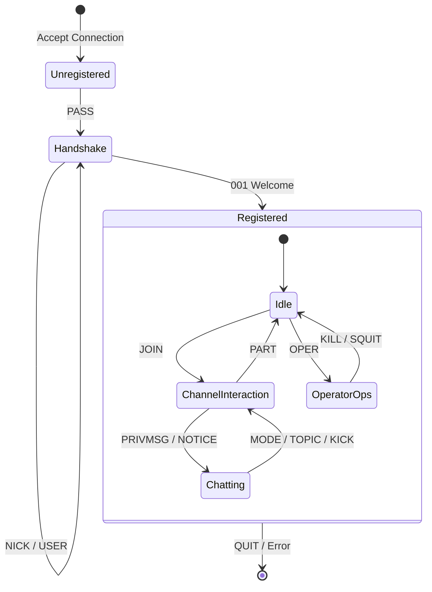

# 📖 IRC Commands Detail & Workflow

This document provides a deep dive into every command implemented in the `srcs/commands` directory. It explains the purpose of the command, the technical concepts it involves, and its place in the global application workflow.

## 📂 Directory Structure

Command implementations are grouped by functionality as defined in RFC 1459/2812.

- **[Registration](#1-registration-commands)**: Authentication and session establishment.
- **[Operator](#2-operator-commands)**: Server maintenance and administration.
- **[Channel](#3-channel-commands)**: Chat room management.
- **[Messaging](#4-messaging-commands)**: Communication between users.
- **[Query & Info](#5-query--info-commands)**: Information retrieval and diagnostics.

---

## 1. Registration Commands
*Path: `srcs/commands/registration/`*

These commands are the **entry point** of the application workflow. No other interaction is possible until this sequence completes.

### `Pass.cpp` (PASS)
- **Concept**: **Connection Security**. The very first command sent by a client.
- **Workflow**: Step 1 of Handshake. Must be sent before NICK/USER.
- **Notions**:
    - **State Machine**: The client is in `HANDSHAKE` state.
    - **Authentication**: Validation against the server password.

### `Nick.cpp` (NICK)
- **Concept**: **Identity**. Sets the unique identifier for the user on the network.
- **Workflow**: Step 2 of Handshake. Can also be used later to change name.
- **Notions**:
    - **Collision Detection**: Ensuring the nickname is unique across the network.
    - **Character Validation**: RFC rules for allowed characters (usually alphanumeric + `[]\{}|`).

### `User.cpp` (USER)
- **Concept**: **Session Metadata**. Provides username, hostname, and realname (GECOS).
- **Workflow**: Step 3 of Handshake. Combined with PASS and NICK, triggers **Registration Completion**.
- **Notions**:
    - **Registration**: Once valid PASS, NICK, and USER are received, the server replies with `RPL_WELCOME` (001).
    - **User Mask**: Constructs the `nick!user@host` identifier.

### `Quit.cpp` (QUIT)
- **Concept**: **Session Termination**. Graceful disconnection.
- **Workflow**: Can happen at any time.
- **Notions**:
    - **Resource Cleanup**: Removing user from all channels, destroying the `User` object, closing the FD.
    - **Broadcasting**: Informing channel peers that the user has left.

---

## 2. Operator Commands
*Path: `srcs/commands/operator/`*

Reserved for **IRC Operators (IRCOPs)**. These commands govern the server itself.

### `Oper.cpp` (OPER)
- **Concept**: **Privilege Escalation**. Turns a regular user into an IRCOP.
- **Workflow**: User sends `OPER <user> <pass>`. If success, receives mode `+o`.
- **Notions**:
    - **Credentials Management**: Validating against a configured operator list.

### `Kill.cpp` (KILL)
- **Concept**: **Forced Disconnection**. Removes a user from the network.
- **Workflow**: Used by IRCOPs to handle abuse/collisions.
- **Notions**:
    - **Global Effect**: Works even if the user is on another server (in multi-server context).
    - **Ghost Handling**: Useful to remove "zombie" connections.

### `Squit.cpp` (SQUIT), `Connect.cpp` (CONNECT)
- **Concept**: **Network Topology**. Connecting/Disconnecting other servers.
- **Workflow**: Server-to-Server links management.

### `Rehash.cpp` (REHASH), `Restart.cpp` (RESTART)
- **Concept**: **Runtime Maintenance**. Reload config or restart process without crashing.

---

## 3. Channel Commands
*Path: `srcs/commands/channel/`*

The core social aspect of IRC. Manages `Channel` objects.

### `Join.cpp` (JOIN)
- **Concept**: **Membership**. Creating or entering a channel.
- **Workflow**: User requests `JOIN #channel`.
    - If channel doesn't exist -> **Create it** + User becomes ChanOp (`@`).
    - If channel exists -> Check rules (key, limit, ban) -> Add user.
- **Notions**:
    - **Channel Modes**: `+k`, `+l`, `+i`.
    - **Multicast**: Sending `JOIN` message to all current members.

### `Part.cpp` (PART)
- **Concept**: **Leaving**. Removing oneself from a channel without disconnecting.
- **Workflow**: Reverse of JOIN.
- **Notions**:
    - **Empty Channel Collection**: If the last user leaves, the `Channel` object is destroyed.

### `Topic.cpp` (TOPIC)
- **Concept**: **Context**. Setting the channel's title/subject.
- **Workflow**: View topic (anyone) or Set topic (ChanOp if `+t` is set).

### `Kick.cpp` (KICK)
- **Concept**: **Moderation**. Forcibly removing a user from a channel.
- **Workflow**: ChanOp sends `KICK #chan user :reason`.
- **Notions**:
    - **Permissions**: Only ChanOps can kick. Cannot kick other ChanOps (depending on implementation/RFC variant).

### `Invite.cpp` (INVITE)
- **Concept**: **Access Control**. Bypassing `+i` (Invite Only) mode.
- **Workflow**: ChanOp invites User. User gets an "Invite Exception" for that channel.

### `Mode.cpp` (MODE)
- **Concept**: **State Management**. The most complex command.
- **Workflow**: `MODE #chan +o user` or `MODE user +i`.
- **Notions**:
    - **Channel Modes**: `o` (Op), `i` (Invite), `t` (Topic), `k` (Key), `l` (Limit).
    - **User Modes**: `i` (Invisible), `o` (Operator).
    - **Parsing**: Handling complex strings like `+ok-l secret key`.

---

## 4. Messaging Commands
*Path: `srcs/commands/messaging/`*

### `Privmsg.cpp` (PRIVMSG)
- **Concept**: **Data Transfer**. The actual chat.
- **Workflow**: `PRIVMSG target :text`.
    - If target starts with `#` -> Channel Broadcast.
    - If target is a nick -> Unicast (Direct Message).
- **Notions**:
    - **Relaying**: For channel messages, iterate over members and `send()` to each (excluding sender).

### `Notice.cpp` (NOTICE)
- **Concept**: **Automatic Responses**. Same as PRIVMSG but **never replies errors**.
- **Workflow**: Used by bots/services to avoid infinite error loops.

---

## 5. Query & Info Commands
*Path: `srcs/commands/query/`*

Diagnostics and data gathering.

### `Who.cpp`, `Whois.cpp`, `Whowas.cpp`
- **Concept**: **Directory Services**. Finding out who is who.
- **Workflow**: Client asks for details on a nick or channel users.

### `Ping.cpp` (PING) / `Pong`
- **Concept**: **Keep-Alive**.
- **Workflow**: Client or Server sends PING. The other MUST reply PONG. If not -> Timeout (Dead connection).

### `List.cpp` (LIST)
- **Concept**: **Discovery**. Listing all available channels.

---

## Global Workflow Diagram

